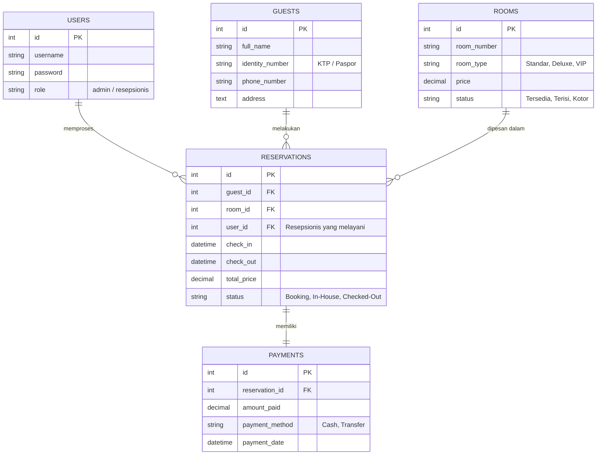

<div align="center">
  <h1>🏨 SysHotel v2 (App New Hotel Melati)</h1>
  <p><strong>Sistem Manajemen Hotel Modern & Responsif</strong></p>
  <p>Dikembangkan oleh <b>edholabs</b></p>
  
  []()
  []()
</div>

---

## 🚀 Tentang Aplikasi (SysHotel v2)
**SysHotel v2** adalah pembaruan besar-besaran dari sistem manajemen perhotelan sebelumnya. Aplikasi ini dirancang khusus untuk mempermudah operasional "Hotel Melati", mulai dari manajemen kamar, reservasi tamu, hingga pencatatan transaksi pembayaran yang lebih cepat dan efisien.

Pada versi 2 ini, sistem telah dioptimalkan dengan antarmuka pengguna (UI) yang lebih responsif dan performa backend yang jauh lebih stabil.

## ✨ Fitur Utama v2
- 🟢 **Manajemen Kamar Real-time**: Melacak status kamar (Tersedia, Terisi, Perbaikan) secara instan.
- 🟢 **Pencatatan Tamu Cerdas**: Input data diri tamu yang cepat dengan validasi otomatis.
- 🟢 **Sistem Reservasi & Check-in/Check-out**: Alur transaksi (booking) yang sangat mulus.
- 🟢 **Laporan Keuangan & Invoice**: Pembuatan struk dan laporan harian/bulanan.

---

## 📊 Skema Database Aplikasi (Entity Relationship)
Aplikasi ini dibangun menggunakan arsitektur database relasional yang terstruktur. Berikut adalah skema (*schema*) inti yang digunakan dalam **SysHotel v2**:



### Penjelasan Tabel Inti:
1. **`users`**: Menyimpan data pegawai hotel (resepsionis, admin).
2. **`rooms`**: Menyimpan master data kamar beserta harga dan ketersediaan saat ini.
3. **`guests`**: Mencatat identitas pengunjung yang menginap.
4. **`reservations`**: Tabel transaksi utama yang menghubungkan Tamu, Kamar, dan Tanggal Menginap.
5. **`payments`**: Menyimpan histori transaksi pembayaran dari reservasi.

---

## 🛠️ Cara Menjalankan Aplikasi
1. Clone repositori ke local server Anda:
   ```bash
   git clone https://github.com/edholabs/syshotel.git
   ```
2. Pastikan Anda berada di branch `v2` (Jika menggunakan branch terpisah):
   ```bash
   git checkout v2
   ```
3. Import database `hotel_melati.sql` (atau file skema SQL yang tersedia) ke dalam MySQL/MariaDB Anda.
4. Sesuaikan konfigurasi koneksi database di file config aplikasi.
5. Jalankan aplikasi melalui Localhost atau server Anda.

---
**Dibuat oleh edholabs © 2026**


# syshotel
**app system information new melati hotel gorontalo**
2008 2026
ZAFALINK
