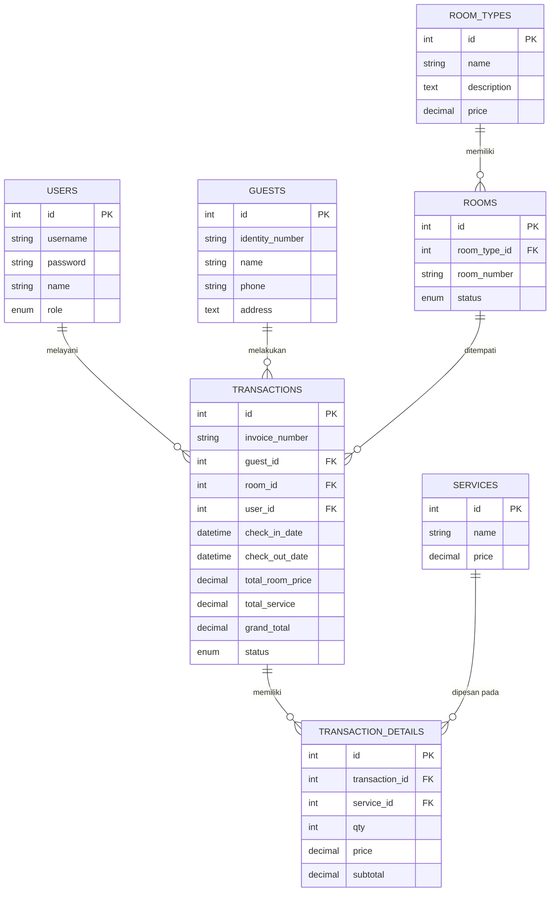

# Syshotel v2 🏨

**Syshotel v2** adalah pembaruan besar (versi 2.0) dari Sistem Informasi Manajemen Hotel Melati. Sistem ini telah ditulis ulang sepenuhnya menggunakan kerangka kerja (framework) **CodeIgniter 4** yang modern dan menggunakan antarmuka dari **AdminLTE 3**. 

Sistem ini dirancang untuk memudahkan staf (resepsionis dan admin) dalam mengelola data master hotel, melacak ketersediaan kamar, mengelola tagihan layanan (*room service*), hingga menangani *check-in* dan pencetakan *invoice check-out*.

## 🌟 Fitur Utama
- **Autentikasi & Keamanan:** Menggunakan filter/middleware session untuk memproteksi *dashboard*.
- **Dashboard Real-Time:** Menghitung total transaksi, pendapatan, tamu, dan tingkat persentase okupansi secara otomatis.
- **Master Data Terpusat:** Pengelolaan Tipe Kamar, Kamar, Tamu, dan Layanan.
- **Transaksi Dinamis:**
  - Auto-filter kamar (hanya menampilkan kamar kosong untuk check-in).
  - Penambahan layanan (mis. makanan, laundry) secara berkali-kali ke dalam tagihan kamar yang sedang aktif.
  - Kalkulasi *Grand Total* secara cerdas berdasarkan jumlah malam (tanggal check-out - check-in).
- **Cetak Tagihan (Invoice):** Format struk siap cetak setelah tamu *check-out*.

## 📊 Diagram Relasi Database (ERD)

Berikut adalah diagram arsitektur tabel yang digunakan dalam sistem ini:



## 🚀 Cara Menjalankan Secara Lokal

Sistem ini sangat mudah dipasang. Pastikan Anda memiliki PHP 8.1+ dan ekstensi MySQLi, Intl, dan Mbstring yang aktif.

1. **Clone repositori ini:**
   ```bash
   git clone https://github.com/edholabs/syshotel-v2.git
   cd syshotel-v2
   ```

2. **Pengaturan Database:**
   - Nyalakan layanan MySQL Anda (lewat XAMPP / Laragon).
   - Buat database kosong bernama `syshotel_v2` (atau jalankan script jika ada).
   - Pastikan konfigurasi kredensial database di file `.env` sudah benar (secara bawaan *password* root dikosongkan).
   - Buka terminal dan jalankan migrasi database serta data awal (seeder):
     ```bash
     php spark migrate
     php spark db:seed UserSeeder
     ```

3. **Jalankan Server Lokal:**
   ```bash
   php spark serve
   ```
   Aplikasi akan berjalan di `http://localhost:8080/`.

4. **Kredensial Default:**
   - **Username:** `admin`
   - **Password:** `admin`

---
*Dibuat khusus untuk EdhoLabs Zafalink (2026).*
